# ANM Validation Across 100 Diverse Protein Structures

*Generated by `validation/run_benchmark.py`; all numbers below are produced by that run (seed 20260930).*

## Benchmark construction

The benchmark list ([protein_benchmark.csv](protein_benchmark.csv)) was built programmatically by
[build_benchmark.py](build_benchmark.py) from the RCSB PDB Search and Data APIs. **The ANM was never run during
selection**, so no correlation result could influence which proteins were chosen, and no protein was added or
removed after seeing results.

Inclusion criteria:

- X-ray diffraction structures, resolution <= 2.5 A.
- One protein entity and a single deposited chain; biological assembly 1 annotated as a monomer.
- 40-500 residues in the analysed chain.
- >= 90 % of the deposited sequence observed; no internal gap longer than 5 residues and <= 5 % of residues missing internally.
- Non-constant B-factors (so a correlation is defined) and a PDB-format file available.
- Keyword classes dominated by close homologs, designed, membrane or unannotated proteins were excluded (immune system/antibody, de novo, virus, membrane protein, toxin, unknown function).

Redundancy control: candidates were restricted to one representative per **30 % sequence-identity cluster** (RCSB
clustering), so no two proteins in the list are in the same 30 % cluster. This is a sequence-based guarantee only;
distant structural relatives (same fold, <30 % identity) can still co-occur.

Diversity: from the pool of structures that passed the filters above, a stratified, seeded greedy selection filled four size bins
(quotas 20/30/30/20), cycled through four fold classes within each bin, and preferred under-represented functional
classes, resolution bands and organisms.

- Size bins (residues): 40-99: 20, 100-199: 30, 200-349: 30, 350-500: 20
- Fold class (heuristic): all-alpha 28, all-beta 28, alpha+beta 25, alpha/beta 19
- Functional class (heuristic): enzyme 19, binding/regulatory 18, other 17, structural 17, transport 17, signaling 12
- 91 distinct source organisms.

The fold and functional labels are **heuristics, not curated annotations**. Fold class comes from the PDB file's own
HELIX/SHEET records (all-alpha: helix >= 25 % and sheet < 5 %; all-beta: helix < 10 % and sheet >= 20 %; otherwise
alpha/beta if >= 50 % of strand residues are in parallel sheets, else alpha+beta). Functional class comes from the
PDB keyword and EC annotation and will misclassify some entries.

## Methods

All calculations use the repository's existing `anm` package, unchanged, with **one parameter set for every protein**
(no per-protein tuning):

- **C-alpha elastic network.** Each residue is one node at its C-alpha position (model 1, the chosen chain; heteroatom residues excluded; alternate locations resolved by the parser to the highest-occupancy atom).
- **Contact cutoff.** Residues i, j are connected if their C-alpha distance is <= 8.0 A.
- **Spring constant.** Uniform gamma = 1.0 for every contact.
- **Hessian.** The 3N x 3N ANM Hessian is assembled from 3 x 3 super-elements -gamma * (u u^T), where u is the unit vector between connected nodes; diagonal blocks are the negative sum of the node's off-diagonal blocks.
- **Normal modes.** The 20 lowest-eigenvalue modes are computed by sparse shift-invert diagonalisation; eigenvalues <= 1e-06 (the 6 rigid-body translations/rotations, plus any extra "floppy" zero modes) are discarded and the next 14 modes are kept. **MSF therefore uses only the 14 lowest non-zero modes**, a truncation inherited from the package default, not tuned.
- **MSF.** MSF_i = sum over kept modes k of (1/lambda_k) * |v_k,i|^2.
- **Comparison with B-factors.** Experimental B-factors are converted with B = 8 pi^2 <u^2> / 3 (the package's `bfactor_to_msf`). Pearson and Spearman correlations are computed between the predicted MSF vector and the experimental C-alpha B-factor vector over the same residues, in residue order. Both metrics are invariant to the overall scale, so the gamma value and the unit conversion do not affect them.
- **Metrics.** Pearson r measures linear agreement; Spearman rho measures rank agreement and is less sensitive to a few extreme residues (typically flexible termini).
- **Collectivity.** Lead-mode collectivity is the package's participation-entropy measure (1/N) exp(-sum p_i ln p_i) for the lowest non-zero mode.
- **Summary statistics.** Per-protein correlations are summarised with mean, median, SD, quartiles and a 10,000-resample percentile bootstrap 95 % CI (seeded). No Fisher-z averaging is applied; r values are averaged directly.
- **Association analysis.** Pearson r is compared with protein properties by Pearson and Spearman correlation across proteins (descriptive; n = 99).

## Dataset

- Structures attempted: **100**
- Analysed successfully: **99**
- Failed: **1** (reported below, not dropped)
- Residue count range (analysed chains): 50-484 (median 194)
- Resolution range: 0.85-2.50 A (median 1.70)
- Mean experimental B-factor range: 5.0-76.2 A^2
- Fold and functional composition: see Benchmark construction. Full per-protein table: [results_100_proteins.csv](results_100_proteins.csv).

### Failures

| PDB_ID | chain | protein_name | failure_reason |
|---|---|---|---|
| 3LPZ | A | Uncharacterized protein | ValueError: Contact network is disconnected into 3 components at cutoff=8.0; increase cutoff or handle components separately. |

### Warnings

43 proteins carry a warning in the `warnings` column of the results file. 43 proteins have more than the expected 6 near-zero modes: the additional zero modes are floppy terminal residues held by too few contacts; they are excluded like the rigid-body modes, so those residues' unconstrained motion is not represented in the MSF.

## Results

### Summary statistics (n = 99)

| Statistic | Pearson r | Spearman rho |
|---|---|---|
| N (valid proteins) | 99 | 99 |
| Mean | 0.403 | 0.513 |
| Median | 0.408 | 0.548 |
| Standard deviation | 0.224 | 0.201 |
| 25th percentile | 0.242 | 0.419 |
| 75th percentile | 0.543 | 0.650 |
| Interquartile range | 0.301 | 0.230 |
| Minimum | -0.051 | -0.131 |
| Maximum | 0.848 | 0.871 |
| 95% bootstrap CI of mean | [0.359, 0.446] | [0.473, 0.553] |
| 95% bootstrap CI of median | [0.336, 0.485] | [0.512, 0.592] |

### Fraction of proteins above correlation thresholds (Pearson r)

| Threshold | % of valid proteins |
|---|---|
| r > 0 | 97.0 % |
| r >= 0.3 | 64.6 % |
| r >= 0.5 | 38.4 % |
| r >= 0.7 | 12.1 % |

Strongest: **3ZSU_A** (Tll2057 Protein), r = 0.848.
Weakest: **2P3H_A** (Uncharacterized Cbs Domain-Containing Protein), r = -0.051.

Proteins with Pearson r < 0 (3):

| PDB_ID | chain | protein_name | n_residues | pearson_r | spearman_rho |
|---|---|---|---|---|---|
| 2P3H | A | Uncharacterized CBS domain-containing protein | 98 | -0.051 | -0.131 |
| 8DLD | A | Chalcone-flavonone isomerase family protein | 207 | -0.041 | 0.129 |
| 7X3H | A | CBg-ParM triple mutant R204D, K230D and N234D | 276 | -0.001 | 0.496 |

### Does performance depend on protein properties?

Association between each property and the per-protein Pearson r (across proteins; associations only, not causal claims):

| Variable | n | Pearson | Spearman |
|---|---|---|---|
| Residue count | 99 | +0.11 (p 0.299) | +0.08 (p 0.414) |
| Resolution (A) | 99 | +0.02 (p 0.873) | +0.01 (p 0.922) |
| Mean experimental B-factor (A^2) | 99 | -0.06 (p 0.574) | -0.08 (p 0.458) |
| Helix fraction | 99 | +0.04 (p 0.726) | +0.03 (p 0.734) |
| Sheet fraction | 99 | -0.03 (p 0.773) | -0.02 (p 0.843) |
| Lead-mode collectivity | 99 | +0.29 (p 0.004) | +0.34 (p <0.001) |

Pearson r by group (Kruskal-Wallis across groups with >= 3 members: fold_class: p = 0.751; functional_class: p = 0.510):

| Grouping | Group | n | Mean r | Median r | SD r |
|---|---|---|---|---|---|
| fold_class | all-alpha | 27 | 0.419 | 0.439 | 0.248 |
| fold_class | all-beta | 28 | 0.397 | 0.414 | 0.215 |
| fold_class | alpha+beta | 25 | 0.363 | 0.372 | 0.249 |
| fold_class | alpha/beta | 19 | 0.440 | 0.415 | 0.165 |
| functional_class | binding/regulatory | 18 | 0.447 | 0.466 | 0.198 |
| functional_class | enzyme | 19 | 0.323 | 0.308 | 0.167 |
| functional_class | other | 17 | 0.455 | 0.435 | 0.248 |
| functional_class | signaling | 12 | 0.363 | 0.390 | 0.268 |
| functional_class | structural | 17 | 0.423 | 0.473 | 0.235 |
| functional_class | transport | 16 | 0.399 | 0.411 | 0.235 |

## Figures

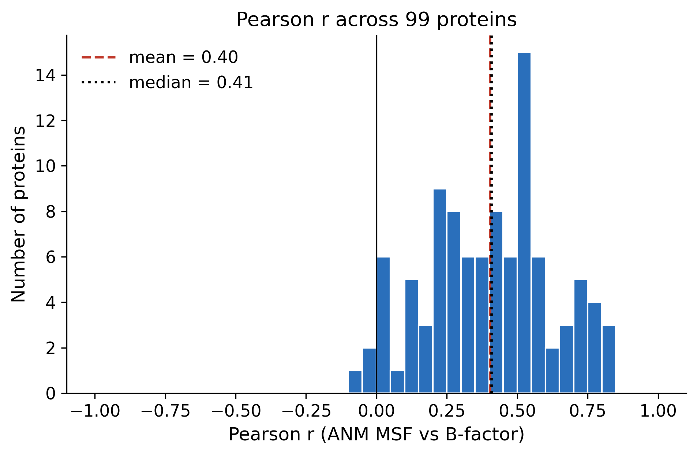  
*fig01_pearson_histogram.png: Histogram of Pearson r across all analysed proteins.*

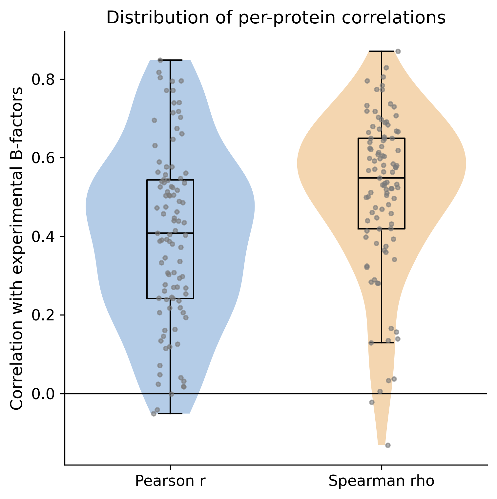  
*fig02_pearson_spearman_box_violin.png: Box/violin plot of Pearson r and Spearman rho (points are individual proteins).*

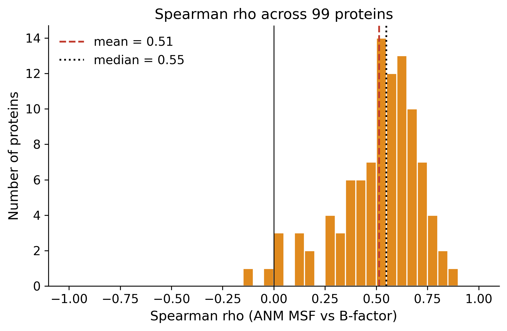  
*fig03_spearman_histogram.png: Histogram of Spearman rho.*

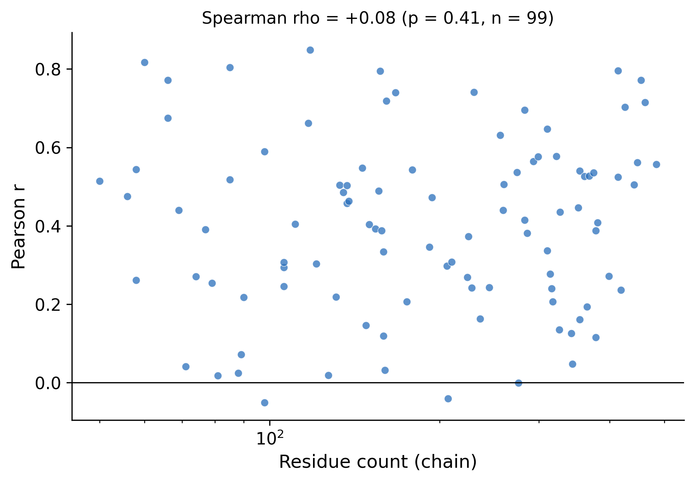  
*fig04_r_vs_size.png: Pearson r versus chain length (log x-axis).*

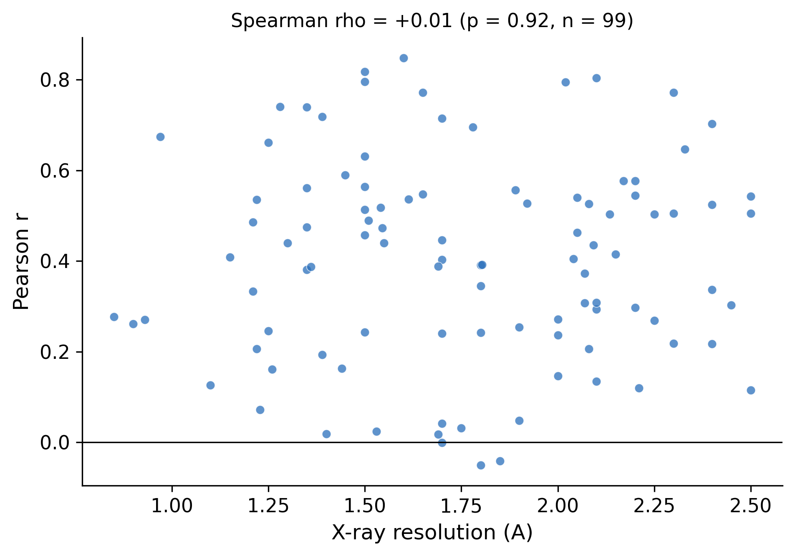  
*fig05_r_vs_resolution.png: Pearson r versus X-ray resolution.*

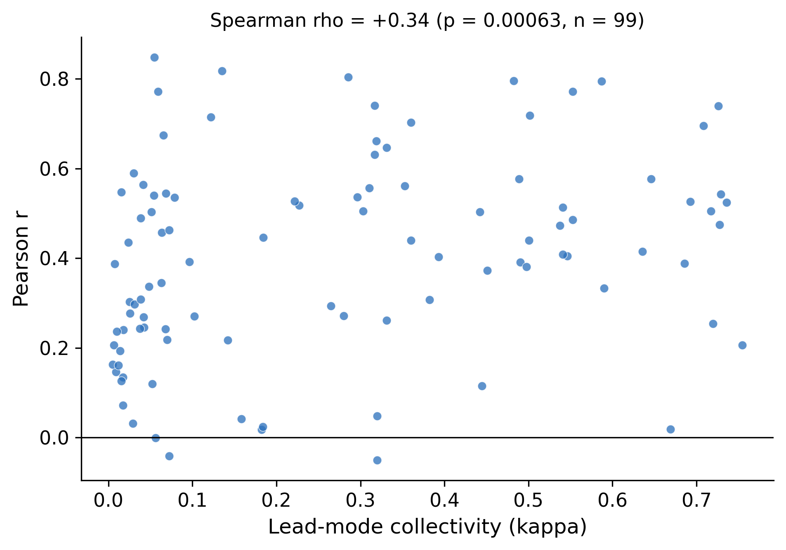  
*fig06_r_vs_collectivity.png: Pearson r versus lead-mode collectivity.*

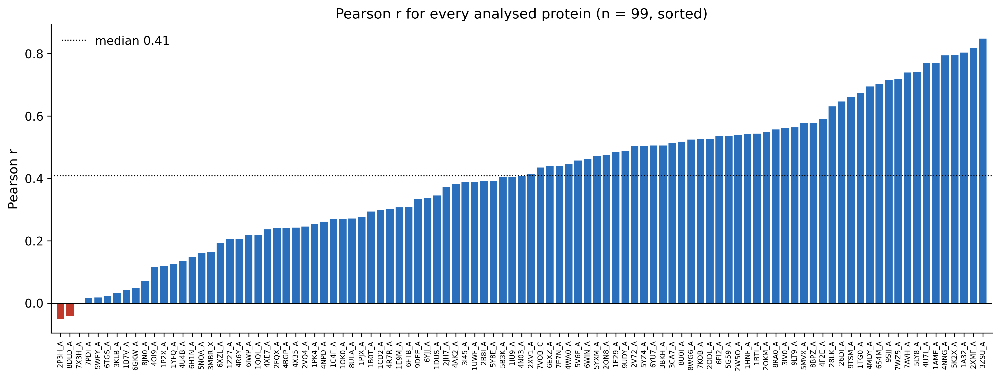  
*fig07_sorted_pearson_bar.png: Pearson r for every analysed protein, sorted.*

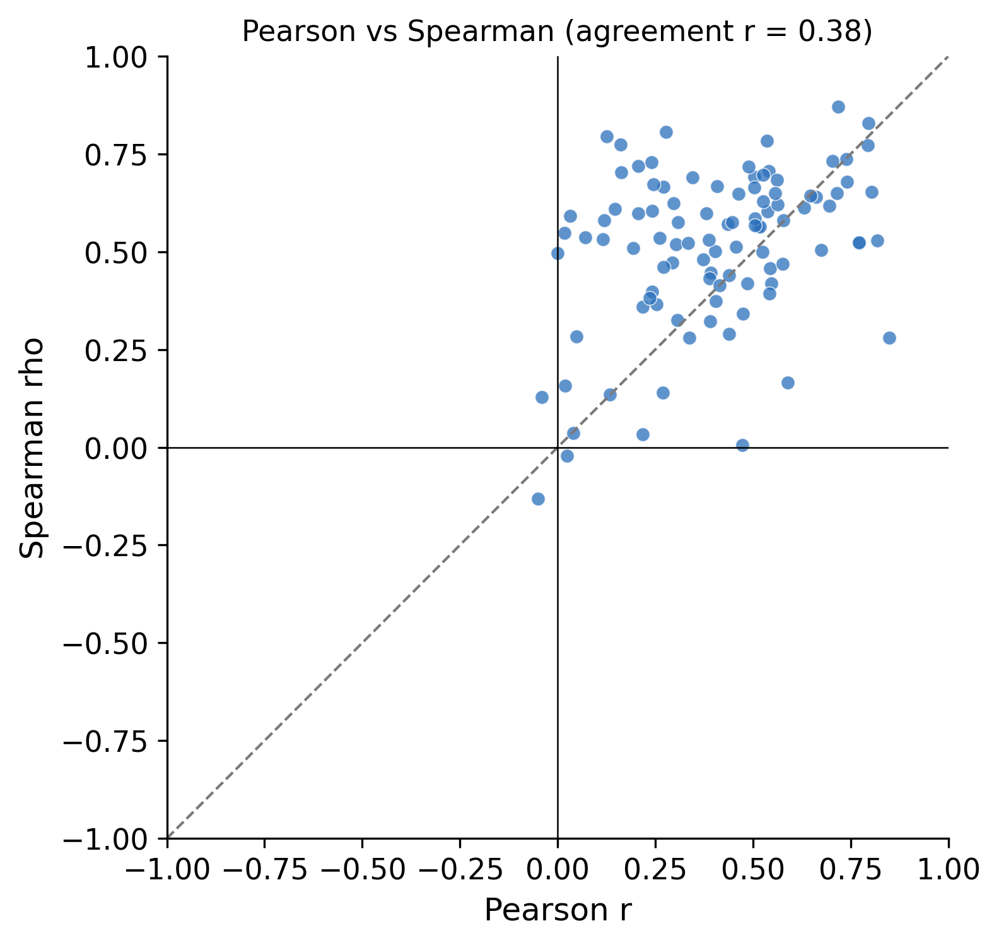  
*fig08_pearson_vs_spearman.png: Pearson r versus Spearman rho per protein.*

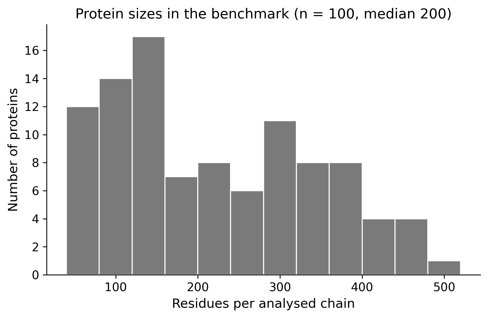  
*fig09_size_distribution.png: Distribution of chain sizes in the benchmark.*

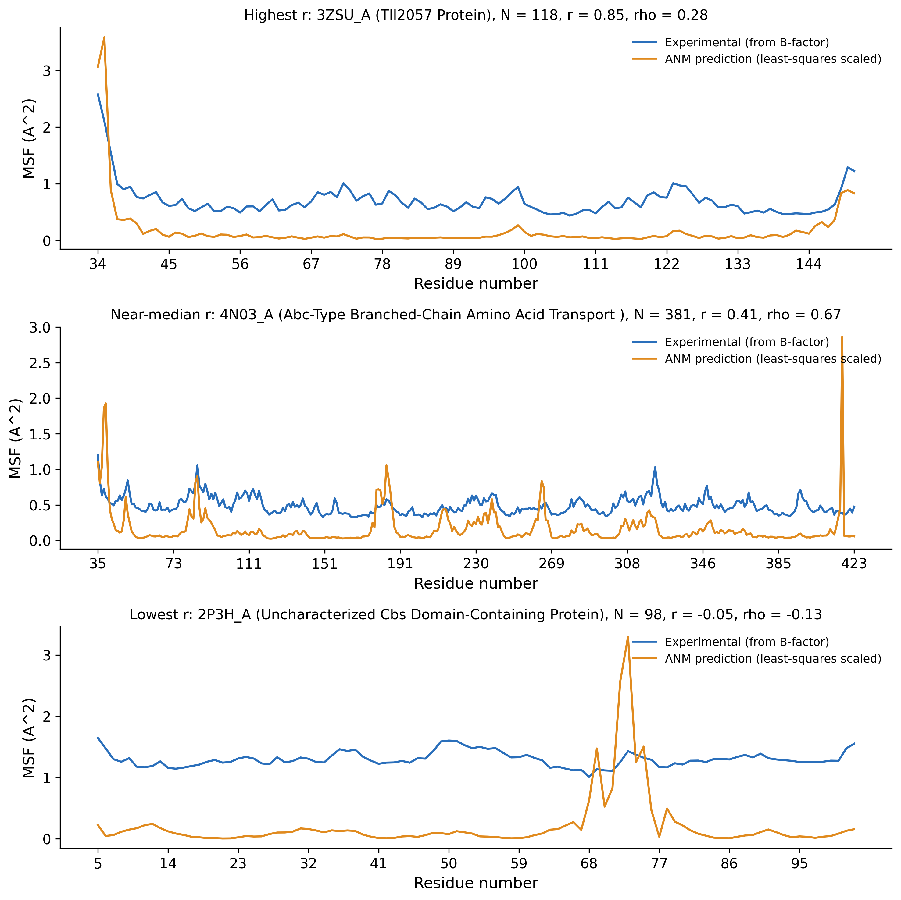  
*fig10_case_studies.png: Case studies: highest, near-median and lowest Pearson r; predicted vs experimental flexibility along the chain.*

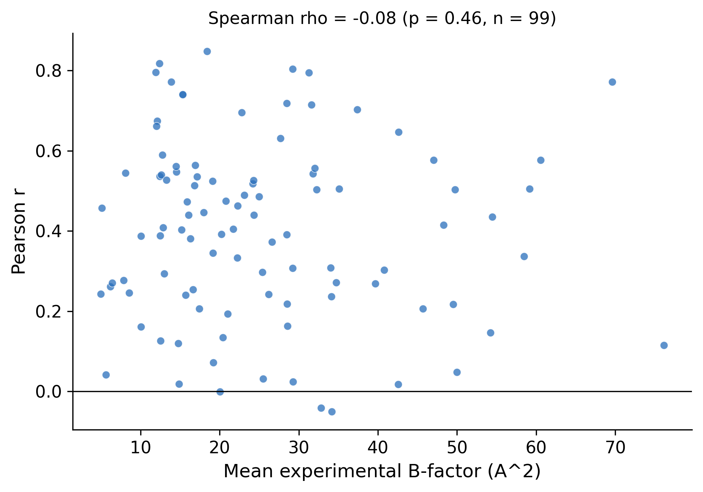  
*fig11_r_vs_mean_bfactor.png: Pearson r versus mean experimental B-factor.*

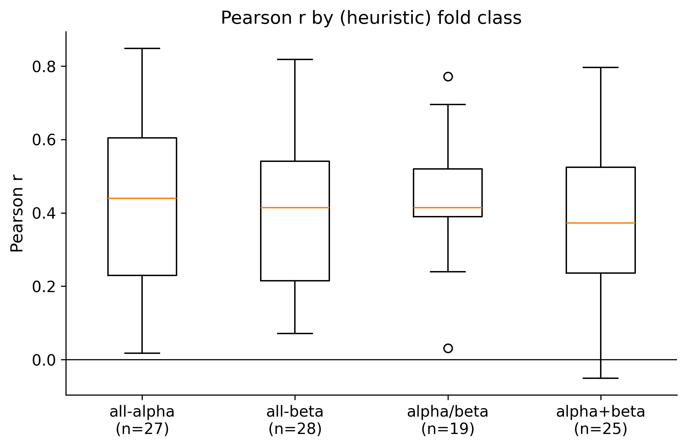  
*fig12_r_by_fold_class.png: Pearson r by heuristic fold class.*

## Interpretation

**What the average means.** Across 99 structurally diverse proteins the mean Pearson r is 0.40
(median 0.41, SD 0.22). The bootstrap 95 % CI of the mean is
[0.36, 0.45]. That is a moderate positive association:
97 % of proteins are positive, but only 38 % reach
r >= 0.5 and 12 % reach r >= 0.7. A correlation of this size means a residue's
ANM flexibility rank is informative about its B-factor rank, and leaves most of the per-residue variance
unexplained (r^2 at the mean r is about 0.16). The spread between proteins is large, so the
mean should not be read as the expected accuracy for any single protein.

**Why the ANM should not reproduce B-factors exactly.** The model is a single-minimum, harmonic, C-alpha-only
network whose only input is geometry. It has no side chains, no chemistry, no solvent and no ligands, and every
contact has the same stiffness. Experimental B-factors contain much more than thermal motion of an isolated
molecule:

- **Crystal packing.** Lattice contacts restrain some surface residues and leave others free; the ANM here sees one isolated chain.
- **Static (lattice) disorder.** Conformational heterogeneity between unit cells contributes to B even at zero temperature.
- **Refinement artefacts.** B-factors depend on the refinement program, restraints, TLS treatment, resolution and occupancy handling, so values are not strictly comparable between structures.
- **Uniform springs.** A single gamma and a hard cutoff ignore that contacts differ in stiffness; terminal and loop residues with few contacts are the usual source of large errors.
- **B-factors as a proxy.** B-factors report average positional spread in a crystal at typically cryogenic temperature, not intrinsic solution dynamics or functional motions.
- **Mode truncation.** Only the 14 lowest non-zero modes contribute, which smooths the predicted profile.

**Why some proteins do better than others.** In this benchmark, Pearson r has the following associations
(Spearman rho across proteins): residue count +0.08 (p 0.414),
resolution +0.01 (p 0.922),
mean B-factor -0.08 (p 0.458),
lead-mode collectivity +0.34 (p <0.001).
These are descriptive associations within a modest sample and many tests; p-values are not corrected for
multiple comparisons, and none of these relationships establishes why a given protein is predicted well or badly.

**Pearson versus Spearman.** The mean Spearman rho (0.51; 95 % CI [0.47, 0.55])
is higher than the mean Pearson r (0.40). Spearman exceeds Pearson by more than 0.2 in 28 proteins,
whereas Pearson exceeds Spearman by more than 0.2 in only 6. A plausible (untested) reading is that a few residues with
very large predicted MSF (isolated terminal or loop residues with few contacts) depress the linear correlation more than the rank
correlation, so the ANM's relative ordering of residues is better than its magnitudes. The reverse also occurs:
the highest-r protein in Figure 10 has r = 0.85 but a much lower rho, because its r is driven almost entirely by
the extremely flexible chain terminus; Pearson r alone can reward predicting a few extreme residues while saying little about the
core. Both metrics should be read together.

**Case studies (Figure 10).** The three panels show different failure/success modes: agreement at flexible termini (highest r), broad
agreement on loop peaks together with an isolated single-residue spike in the prediction (near-median), and a predicted loop peak
that has no counterpart in a nearly flat experimental profile (lowest r). These are single examples chosen by rank, not
representative mechanisms.

## Limitations

- **Benchmark-selection bias.** Selection favours well-ordered, monomeric, high-resolution, single-chain structures that crystallise readily; flexible, multi-domain, disordered or membrane proteins are under-represented. Filtering on observed-residue coverage removes proteins with large disordered regions, which are exactly the flexible ones. The result describes this population, not proteins in general. Fold and function labels are heuristic.
- **B-factor limitations.** See Interpretation; B-factors mix dynamics, disorder and refinement choices and are compared here without any per-structure correction (no TLS decomposition, no normalisation by resolution or packing).
- **X-ray structures only.** No NMR, cryo-EM or room-temperature data; crystal environment affects every entry.
- **One parameter set.** cutoff 8.0 A, gamma 1.0, 14 kept modes, applied uniformly by design. These were not optimised; other cutoffs or all-mode MSF would give different numbers, and no sensitivity analysis is included in this report.
- **Missing residues.** Up to 5 % of residues may be missing internally and up to 10 % of the sequence unobserved; the missing segments are simply absent from the network, which can disconnect it or alter local stiffness. One disconnected-network failure is an example (see Failures).
- **Crystal contacts.** Only the isolated chain (monomer, one asymmetric-unit copy) is modelled; lattice neighbours are ignored.
- **Differences in refinement procedures.** Deposited B-factors come from different programs and protocols; no harmonisation was attempted.
- **Statistics.** Proteins are treated as independent (30 % identity clusters), but structural-family relationships below that threshold remain. The bootstrap CI reflects sampling variability of this benchmark, not selection bias.
- **Quality control performed.** no duplicate PDB-chain pairs; no duplicate PDB IDs; all 100 benchmark proteins present in results (failures included); no NaN/inf in pearson_r, spearman_rho, lead_mode_collectivity of valid proteins; 6 rigid-body modes removed in all 99 valid proteins; 43 have extra near-zero (floppy-terminus) modes, also excluded and flagged in `warnings`. Correlations use index-aligned MSF and B vectors with one shared finite-value mask, and the Pearson value was cross-checked against the package's own `validate()` output.

## Conclusion

On 99 non-redundant X-ray monomers analysed with a single untuned parameter set, Cα-ANM predictions of residue
flexibility show a moderate positive rank and linear relationship with experimental B-factors (mean Pearson r
0.40, median 0.41; 95 % CI of the mean [0.36, 0.45];
mean Spearman rho 0.51, higher than mean Pearson r, which suggests a few extreme predicted residues depress the linear correlation). Performance varies widely, from r = -0.05 to 0.85, and
3 proteins are not positively correlated. The model captures a real but partial signal of relative
flexibility; it is not a quantitative predictor of B-factors, and these results do not show it reflects
solution dynamics beyond what crystallographic B-factors measure.
